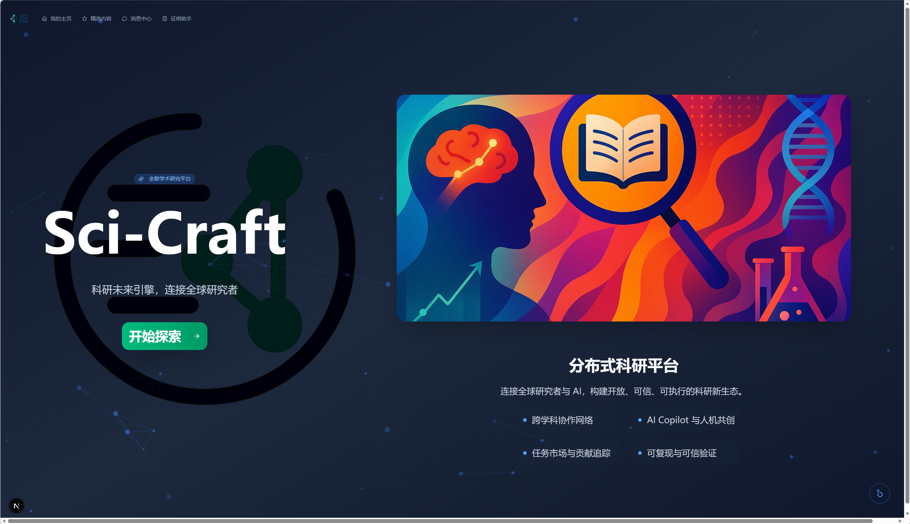
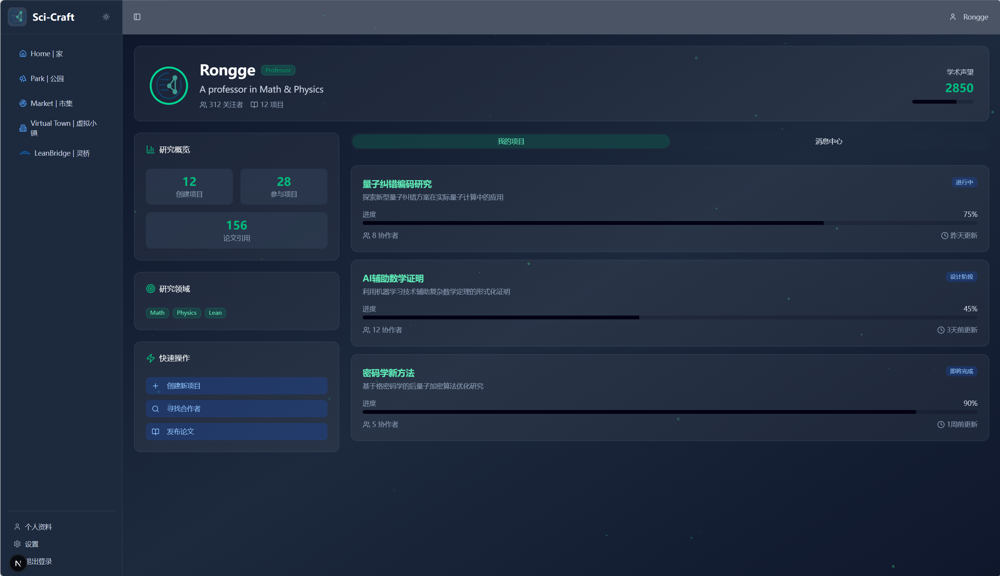
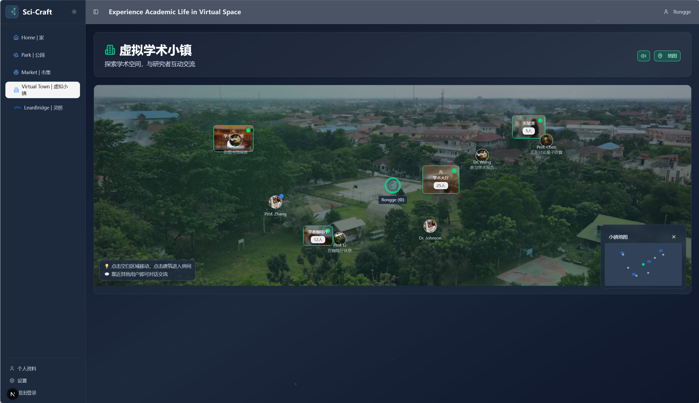

# LeanBridge Project

LeanBridge is a multi-agent Lean 4 proof assistant. The project adopts a decoupled frontend-backend architecture, with the backend based on the OpenAI Agents SDK and the frontend based on the AG-UI protocol and React. Sci-Craft / LeanBridge won **first place** at the [AI for Science Hackathon · Beijing](https://ai4.science/events/beijing-hackathon#).

## Project Structure

```text
LeanBridge/
├── docs/screenshots/    # Frontend UI screenshots used in this README
├── client/              # [TBD] React-based web frontend
└── server/              # [Core] Python backend project (Agents, API, Lean interaction)
    ├── agent/           # Agent logic (Plan, Code, Search, Verify)
    ├── cli.py           # Interactive Command Line Interface (CLI) entry point
    ├── app.py           # FastAPI Web Service entry point
    ├── env_setup.py     # Environment initialization and path management
    ├── config.py        # Configuration loading and management
    ├── config.yaml      # Configuration file (model selection, parameters, etc.)
    ├── .env             # Environment variables (API Keys, sensitive info)
    └── requirements.txt # Backend dependencies (including customized SDK)
```

## Quick Start (Backend)

1.  **Install Environment**:
    Ensure Python 3.10+ is installed. This project depends on a customized version of the OpenAI Agents SDK.
    ```bash
    cd server
    pip install -r requirements.txt
    ```

2.  **Configure System**:
    *   **Environment Variables**: Create a `.env` file based on `.env.example`, and fill in the model API Key and Base URL.
    *   **YAML Configuration**: Create a `config.yaml` file based on `config.yaml.example`, and adjust the agent model settings.

3.  **Run the Application**:

    *   **Option A: Start Interactive CLI (Recommended for Dev/Test)**
        ```bash
        cd server
        python cli.py
        ```
        Enter the command-line interface to interact directly with the Plan Agent.

    *   **Option B: Start Web API Service**
        ```bash
        cd server
        python app.py
        ```
        The service runs on `http://localhost:8000` by default and can be used with the frontend.

## Tech Stack

- **LLM SDK**: [sciencraft/openai-agents-python](https://github.com/sciencraft/openai-agents-python.git) (Customized Version)
- **Web Framework**: FastAPI & AG-UI
- **Agent Framework**: Wrapped based on OpenAI Agents SDK
- **Verification**: FastMCP & Lean 4

## Frontend (Client)

The web client is a React app for **Sci-Craft**, a distributed research platform. LeanBridge appears in the sidebar as the formal-proof assistant. Representative screens:

### Homepage

Landing page for Sci-Craft: product intro, call to action, and the four platform pillars (cross-disciplinary collaboration, AI Copilot, task market, and verifiable proofs).



### Researcher Profile

Personal workspace with research overview, fields, academic reputation, and project progress (created / joined projects, citations, and quick actions).



### Virtual Town

Map-style academic space: rooms (library, lab, AI hall), nearby researchers, and a mini-map for exploring and chatting in the virtual campus.


